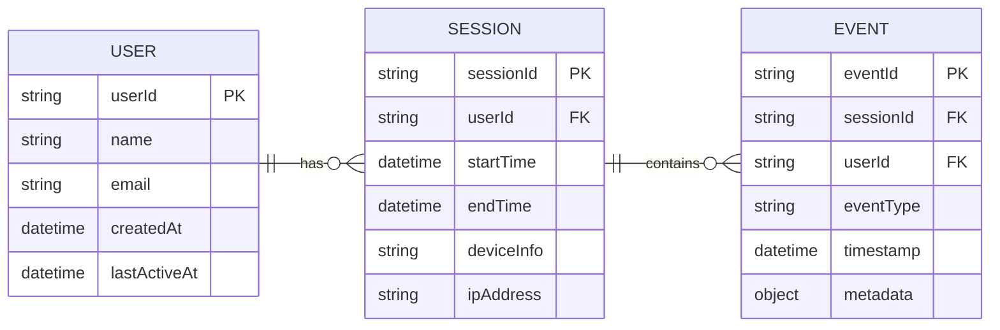

# User journey tracker

A MERN stack (MongoDB, Express, React, Node.js) application with TypeScript that tracks and visualises user behaviours and journeys on a shopping platform. The system records key user events e.g. session start time, pages visited, purchase count, time spent on pages, and provides searchable insights for individual users.

## Installation Guide

### Prerequisites

- Node.js (version 16 or higher)
- npm or yarn
- MongoDB (local or cloud instance)

### Setup Steps

1. **Clone and navigate to the project**

   ```bash
   git clone <your-repo-url>
   cd user-journey-tracker
   ```

2. **Install server dependencies**

   ```bash
   cd server
   npm install
   ```

3. **Install client dependencies**

   ```bash
   cd ../client
   npm install
   ```

4. **Set up environment variables**

   - Create `server/config.env` file
   - Add your MongoDB connection string and any other required environment variables
   - TBA: add test user to Mongo?

5. **Build the server**

   ```bash
   cd server
   npm run build
   ```

6. **Start the development environment**
   ```bash
   cd ..
   ./start-dev.sh
   ```

### What the script does:

- Builds the TypeScript server code
- Starts the server on port 5050
- Starts the React client on port 3000
- Opens the frontend in your browser

### Access points:

- Frontend: http://localhost:3000
- API: http://localhost:5050
- API Documentation: http://localhost:5050/api-docs

## Chosen tracks & justifications

### Database L2

#### L1: DB Schema/diagram for main system entities and data fields.

##### Data model

I generated the possible entities with ChatGPT:

`users`

```json
{
  "_id": "u123",
  "name": "Alice",
  "email": "alice@example.com",
  "createdAt": "2025-01-01T10:00:00Z",
  "lastActiveAt": "2025-09-13T12:00:00Z"
}
```

`sessions`

```json
{
  "_id": "s456",
  "userId": "u123",
  "startTime": "2025-09-13T12:00:00Z",
  "endTime": "2025-09-13T13:15:00Z",
  "deviceInfo": { "browser": "Chrome", "os": "Windows" },
  "ipAddress": "192.168.1.10"
}
```

`events`

```json
{
  "_id": "e789",
  "sessionId": "s456",
  "userId": "u123",
  "eventType": "PAGE_VIEW",
  "timestamp": "2025-09-13T12:05:00Z",
  "metadata": { "pageUrl": "/electronics/phones", "duration": 45 }
}
```



#### Best storage approach for search

TBA

#### L2: DB implementation using free-tier cloud service.

##### Mongo DB vs Amazon Document DB

I chose MongoDB Atlas on AWS because MongoDB was a requirement for this project, and Atlas provides a fully managed, scalable, and secure environment suitable for our needs.

Although Amazon DocumentDB is also MongoDB compatible, I found that Atlas offers all the features necessary to host and run this exercise efficiently.

---

### API L2

---

### Cloud L1

---

### Frontend L4

#### L1: Basic and sample wireframes to provide the idea (pages/views) with some user stories

Functionalities: search, session start time, number of pages/items visited, purchase count, and time spent on specific pages

User stories:

- As an operational agent, I'd like to search by users to see detailed user activity with session time, pages visited and items purchased so I can investigate specific issues.
- As a product manager, I'd like to see how many people drop off after a certain page so I can initiate improvements.
- As a marketing analyst, I'd like to filter user journeys by date range and channel so that I can compare seasonal or campaign-driven behavior.
- As a business owner, I'd like to see what are the best selling products are by purchase count or time spent on each page so I can maintain stock.
- As a product analyst, I'd like to see how long customers are spending on each page so I can identify drop off points.


#### L2: More advanced prototype or MVP to present the idea (Pages transition and basic actions, but not connected to the Backend API)

Tech used: tba


#### L3: Simple Web App (hosted at least locally) with data display/visualization views/pages connected to Backend API (no data entry forms)
