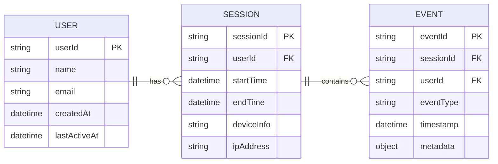

# User journey tracker

A MERN stack (MongoDB, Express, React, Node.js) application with TypeScript that tracks and visualises user behaviours and journeys on a shopping platform. The system records key user events e.g. session start time, pages visited, purchase count, time spent on pages, and provides searchable insights for individual users.

## Other documents

[Search considerations](docs/search_considerations.md)

[Development workbook](docs/development_workbook.md)

## Installation Guide

### Prerequisites

- Node.js (version 16 or higher)
- npm or yarn
- MongoDB (local or cloud instance)

### Setup Steps

1. **Clone and navigate to the project**

   ```bash
   git clone <your-repo-url>
   cd user-journey-tracker
   ```

2. **Install server dependencies**

   ```bash
   cd server
   npm install
   ```

3. **Install client dependencies**

   ```bash
   cd ../client
   npm install
   ```

4. **Set up environment variables**

   - Create `server/config.env` file
   - Add your MongoDB connection string and any other required environment variables
   - **TBA: add test user to Mongo? add test credentials**

5. **Build the server**

   ```bash
   cd server
   npm run build
   ```

6. **Start the development environment**
   ```bash
   cd ..
   ./start-dev.sh
   ```

### What the script does:

- Builds the TypeScript server code
- Starts the server on port 5050
- Starts the React client on port 3000
- Opens the frontend in your browser

### Access points:

- Frontend: http://localhost:3000
- API: http://localhost:5050
- API Documentation: http://localhost:5050/api-docs

## Chosen tracks & justifications

### Database L2

#### L1: DB Schema/diagram for main system entities and data fields.

##### Data model

I generated the possible entities with ChatGPT:

`users`

```json
{
  "_id": "u123",
  "name": "Alice",
  "email": "alice@example.com",
  "createdAt": "2025-01-01T10:00:00Z",
  "lastActiveAt": "2025-09-13T12:00:00Z"
}
```

`sessions`

```json
{
  "_id": "s456",
  "userId": "u123",
  "startTime": "2025-09-13T12:00:00Z",
  "endTime": "2025-09-13T13:15:00Z",
  "deviceInfo": { "browser": "Chrome", "os": "Windows" },
  "ipAddress": "192.168.1.10"
}
```

`events`

```json
{
  "_id": "e789",
  "sessionId": "s456",
  "userId": "u123",
  "eventType": "PAGE_VIEW",
  "timestamp": "2025-09-13T12:05:00Z",
  "metadata": { "pageUrl": "/electronics/phones", "duration": 45 }
}
```



#### L2: DB implementation using free-tier cloud service.

##### Mongo DB vs Amazon Document DB

I chose MongoDB Atlas on AWS because MongoDB was a requirement for this project, and Atlas provides a fully managed, scalable, and secure environment suitable for our needs.

Although Amazon DocumentDB is also MongoDB compatible, I found that Atlas offers all the features necessary to host and run this exercise efficiently.

---

### API L2

#### L1: API Documentation with all essential endpoints (Using Swagger or something similar will be good).

API documentation is available after installation on: http://localhost:5050/api-docs


#### L2: Full API implementation. It should be working and hosted locally (The API should be available for testing via tools like Postman).

API can be called and tested after local setup is done.

1. CURL:

`curl -X GET "http://localhost:5050/api/users/1f07b975-59d5-41ee-9c86-5a49c7d09316" -H "Accept: application/json"`

2. Postman:


---

### Cloud L1

---

### Frontend L3

#### L1: Basic and sample wireframes to provide the idea (pages/views) with some user stories

Functionalities: search, session start time, number of pages/items visited, purchase count, and time spent on specific pages

User stories:

- As an operational agent, I'd like to search by users to see detailed user activity with session time and pages visited so I can investigate specific issues.
- As a product manager, I’d like to identify which users have high session frequency but no purchases so I can explore potential friction points.
- As a business owner, I’d like to monitor the trend of total sessions vs. unique users so I can assess repeat engagement.
- As a product analyst, I'd like to see how long customers are spending on each page so I can identify drop off points.


#### L2: More advanced prototype or MVP to present the idea (Pages transition and basic actions, but not connected to the Backend API)

| Dashboard page                           | Users page                       | Single user page                             |
| ---------------------------------------- | -------------------------------- | -------------------------------------------- |
|  |  |  |

#### L3: Simple Web App (hosted at least locally) with data display/visualization views/pages connected to Backend API (no data entry forms)

<video width="640" height="360" controls>
  <source src="/assets/example-flow.mov" type="video/mp4">
  Your browser does not support the video tag.
</video>

## Bonus challenge

### Localisation on the client side

**i18n justification:**  
Client-side internationalisation was chosen here to speed up development, as I already had experience with i18n libraries. This allows for fast implementation of multi-language support, dynamic content rendering, and consistency across UI components without adding server complexity.
