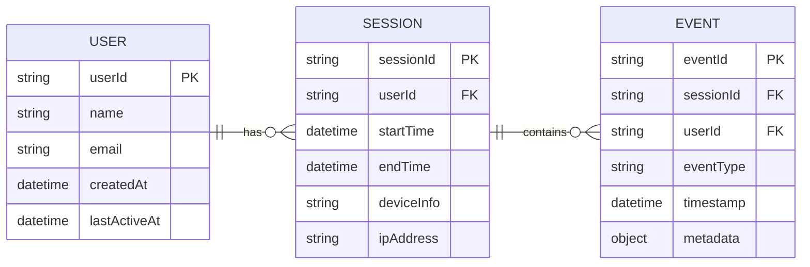

# User journey tracker

A MERN stack (MongoDB, Express, React, Node.js) application with TypeScript that tracks and visualises user behaviours and journeys on a shopping platform. The system records key user events e.g. session start time, pages visited, purchase count, time spent on pages, and provides searchable insights for individual users.

## Chosen tracks

### Database L2

#### L1: DB Schema/diagram for main system entities and data fields.

I generated the possible entities with ChatGPT:

`users`

```json
{
  "_id": "u123",
  "name": "Alice",
  "email": "alice@example.com",
  "createdAt": "2025-01-01T10:00:00Z",
  "lastActiveAt": "2025-09-13T12:00:00Z"
}
```

`sessions`

```json
{
  "_id": "s456",
  "userId": "u123",
  "startTime": "2025-09-13T12:00:00Z",
  "endTime": "2025-09-13T13:15:00Z",
  "deviceInfo": { "browser": "Chrome", "os": "Windows" },
  "ipAddress": "192.168.1.10"
}
```

`events`

```json
{
  "_id": "e789",
  "sessionId": "s456",
  "userId": "u123",
  "eventType": "PAGE_VIEW",
  "timestamp": "2025-09-13T12:05:00Z",
  "metadata": { "pageUrl": "/electronics/phones", "duration": 45 }
}
```



#### L2: DB implementation using free-tier cloud service.

##### Mongo DB vs Amazon Document DB

I chose MongoDB Atlas on AWS because MongoDB was a requirement for this project, and Atlas provides a fully managed, scalable, and secure environment suitable for our needs.

Although Amazon DocumentDB is also MongoDB compatible, I found that Atlas offers all the features necessary to host and run this exercise efficiently.
