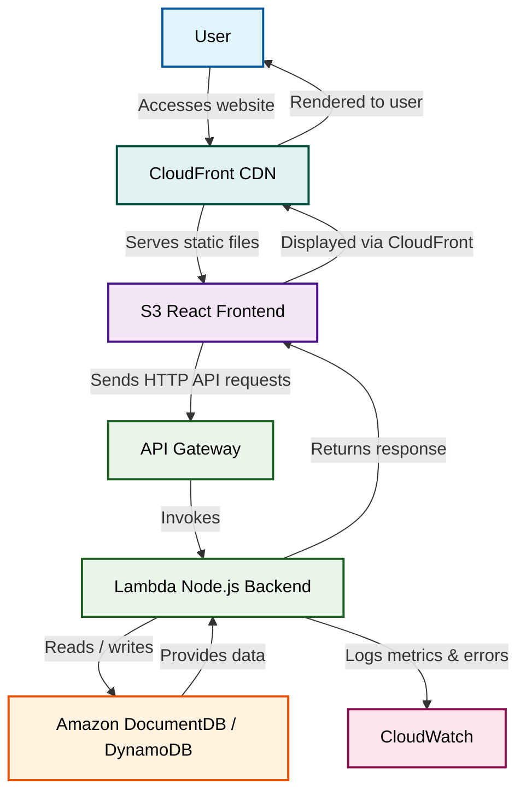

# Architecture diagram

## System Architecture

```mermaid
flowchart TB
    %% Styling
    classDef userClass fill:#e1f5fe,stroke:#01579b,stroke-width:2px,color:#000
    classDef frontendClass fill:#f3e5f5,stroke:#4a148c,stroke-width:2px,color:#000
    classDef backendClass fill:#e8f5e8,stroke:#1b5e20,stroke-width:2px,color:#000
    classDef databaseClass fill:#fff3e0,stroke:#e65100,stroke-width:2px,color:#000
    classDef monitoringClass fill:#fce4ec,stroke:#880e4f,stroke-width:2px,color:#000
    classDef cdnClass fill:#e0f2f1,stroke:#004d40,stroke-width:2px,color:#000

    %% Nodes
    U[User]
    CF[CloudFront CDN]
    FE[S3 React Frontend]
    GW[API Gateway]
    L[Lambda Node.js Backend]
    DB[Amazon DocumentDB / DynamoDB]
    CW[CloudWatch]

    %% User to Frontend
    U -->|"Accesses website"| CF
    CF -->|"Serves static files"| FE

    %% Frontend to Backend
    FE -->|"Sends HTTP API requests"| GW
    GW -->|"Invokes"| L

    %% Backend to Database
    L -->|"Reads / writes"| DB

    %% Backend monitoring
    L -->|"Logs metrics & errors"| CW

    %% Data flow back to Frontend
    DB -->|"Provides data"| L
    L -->|"Returns response"| FE
    FE -->|"Displayed via CloudFront"| CF
    CF -->|"Rendered to user"| U

    %% Apply styles
    class U userClass
    class CF cdnClass
    class FE frontendClass
    class GW,L backendClass
    class DB databaseClass
    class CW monitoringClass
```

## Components, notes
